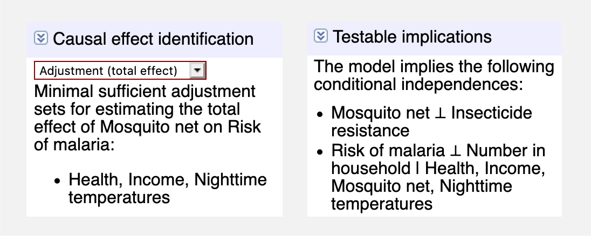

```{r setup, include=FALSE}
knitr::opts_chunk$set(warning = FALSE, message = FALSE, 
                      fig.align = "center")
```

\setcounter{section}{9}

# Causal Inference {#causalinference}

*Andrew Heiss*^[E-mail: aheiss\@gsu.edu. Twitter: \@andrewheiss]


### Suggested readings {-}

- Elwert, F. (2013). Graphical Causal Models. In S. L. Morgan (Ed.), *Handbook of Causal Analysis for Social Research* (pp. 245--273). Springer.

- Hernán, M. A., & Robbins, J. M. (2020). *Causal Inference: What If*. CRC Press.

- Morgan, S. L., & Winship, C. (2007). *Counterfactuals and Causal Inference: Methods and Principles for Social Research*. Cambridge University Press.

- Pearl, J., Glymour, M., & Jewell, N. P. (2016). *Causal Inference in Statistics: A Primer*. Wiley.

- Pearl, J., & Mackenzie, D. (2018). *The Book of Why: The New Science of Cause and Effect*. Basic Books.

- Rohrer, J. M. (2018). Thinking Clearly About Correlations and Causation: Graphical Causal Models for Observational Data. *Advances in Methods and Practices in Psychological Science*, *1*(1), 27--42.

- Shalizi, C. R. (2019). *Advanced Data Analysis From an Elementary Point of view*. <https://www.stat.cmu.edu/~cshalizi/ADAfaEPoV/ADAfaEPoV.pdf>

    + Chapters 19, 20, 21, and 22: "Graphical Causal Models," "Identifying Causal Effects," "Estimating Causal Effects," and "Discovering Causal Structure"


### Packages you need to install {-}

- `tidyverse`, `ggdag`, `dagitty`, `MatchIt`, `broom`, `texreg`


## Introduction

One of the most repeated phrases in any introductory statistics class is the warning that "correlation is not causation." In political science research, though, we are often concerned about the causes of social and political phenomena. Does government spending on education decrease social inequality? Does increased executive power cause regime collapse? Does increased ethnofractionalization cause genocide? Do international development projects reduce poverty or increase health? These are important questions, but using the statistical methods covered in this book, we can only talk about these relationships using associational language. In Chapter 6 we found that education expenditures are associated with increased inequality, and in Chapter 9 we found that increased concentration of executive power is associated with a lower probability of the regime collapsing. Though we were very careful to not use causal language when interpreting these regression coefficients, we are ultimately concerned with causation, especially if we have the ability to influence policy. If a development intervention *causes* improvements in health, it would be valuable to roll it out on a large scale. 

It is easy enough to run a regression that includes two seemingly unrelated variables and find that they are actually significantly correlated. For instance, in the United States, per capita consumption of mozzarella cheese correlates strongly ($r = 0.959$) with the number of civil engineering doctorates awarded (see Figure \@ref(fig:dr-cheese)). Mathematically there is no difference between the strong relationship between cheese consumption and doctoral degrees in civil engineering and the strong relationship between education spending and social inequality. Both relationships are defined by a single number: a regression coefficient. However, the relationship between cheese and degrees does not mean that increased consumption of cheese will create new PhD-holders, nor does it mean that the increasing ranks of civil engineers are causing an uptick in the amount of cheese Americans are eating. We can readily discount this relationship as spurious. 

```{r dr-cheese, echo=FALSE, fig.cap="The high correlation between cheese and civil engineering"}
knitr::include_graphics("images/dr-cheese.pdf")
```

We are less likely to call the relationship between education spending and inequality spurious. We did not immediately laugh off the correlation we found in Chapter 6, and there are many published academic papers that investigate the genuine relationship between them. Why? The difference between the plausibility of the two relationships goes beyond statistics. There is no believable causal story linking cheese consumption and doctoral degrees, despite the high correlation between the two. There *is* a believable causal story between inequality and education, since increasing the quality of education enhances the employment opportunities available to students after graduation. 

In this chapter, we present new non-statistical language for creating, measuring, and evaluating causal stories and relationships using observational (i.e. non-experimental) data. We introduce the concept of causal directed acyclic graphs (DAGs) that allow us to formally encode our understanding of causal stories. With well-crafted DAGs, we can use a set of rules called *do*-calculus to make specific adjustments to statistical models and isolate or identify causal relationships between variables of interest. 


## Causation and causal graphs

Unlike correlation, which at its core is simply a mathematical formula, there is no `causation()` function in R. Causation is a question of philosophy and theory, not math. Debates over the definition of causation have been waged for thousands of years—Plato and Aristotle wrote about the metaphysics and components of causal relationships. For the sake of simplicity, in this chapter we will use a fairly universal definition: $X$ can be said to cause $Y$ if:

- **Association**: $X$ and $Y$ are *associated* with each other
- **Time ordering**: $X$ *precedes* $Y$
- **Nonspuriousness**: The association between $X$ and $Y$ is *not spurious*

More simply, we can collapse all three of these conditions into a single definition:

> A variable $X$ is a cause of a variable $Y$ if $Y$ in any way relies on $X$ for its value.… $X$ is a cause of $Y$ if $Y$ listens to $X$ and decides its value in response to what it hears [@PearlGlymourJewell:2016, 5--6]

The concept of variables "listening to" each other simultaneously incorporates association, time ordering, and nonspuriousness. Consider the relationship between flipping a light switch and turning on a light. The act of enabling a light switch is associated with a light bulb emitting light, indicating an association between the two.  A light bulb cannot emit light before it is turned on, thus ensuring correct time ordering—flipping the switch must precede the light. Finally, the association is nonspurious since there is a plausible link between the two: electrical pulses travel through wires to equipment that transforms the power to current that can ultimately power the bulb. We can also more simply say that the a light bulb "listens to" the light switch. Changes to the switch's on/off state influence the state of the bulb further down the causal chain. A light bulb listens to many other factors—electricity must flow into the building, transformers must function properly, and multiple switches might control the same light—but a single switch is definitely one of the causes of emitting light.

```{r general-examples, echo=FALSE, fig.cap="Various DAGs"}
knitr::include_graphics("output/general-examples.pdf")
```

We can encode the philosophy or theory of a causal chain of events in a directed acyclic graph, or DAG. DAGs are graphical models of the process that generates the data and outline how $X$ causes $Y$ (see panel A of Figure \@ref(fig:general-examples)) These graphs consist of three core elements: nodes, edges (or arrows), and direction. **Nodes** represent phenomena that have causal relationships to other elements in the system. These can be things that are measurable and could included a dataset, such as GDP, population, political party, length of time in office, income, geographic location, or socioeconomic status. Nodes do not necessarily need to be measurable—limitations in data collection or variable abstraction can make it impossible to collect reliable measurements on different phenomena. If this is the case, the node should still be included in the graph, but should be considered *unobserved* or *latent*. Nodes also represent treatment and outcome variables (see panel B in Figure \@ref(fig:general-examples)). For instance, if we are interested in the causal effect of education expenditures on inequality (as in chapter 6), education expenditures would be the *treatment* or *exposure*, and Gini-based social inequality would be the *outcome*.

**Edges** (or arrows) transmit associations between nodes. For instance, if a graph shows that $X \rightarrow Y$, $X$ has a causal association with $Y$, or $Y$ "listens to" or responds to $X$. Crucially, the absence of an edge between nodes implies that there is no causal relationship between the nodes. Causal associations between nodes can only flow in one **direction**—arrows can never go in both directions (e.g. $X \leftrightarrow Y$), and it should be impossible to return to any given node while walking through the graph (e.g. $X \rightarrow Z \rightarrow Y \rightarrow Z \rightarrow X$). Often there is a valid reason to include looping or feedback edges. For instance, education expenditures can lead to inequality, which then leads to changes in education expenditures. In these situations, rather than include bidirectional arrows, it is best to distinguish between the two periods of education expenditures, often using the subscript $t$ for time: $X_{t-1} \rightarrow Y_{t-i} \rightarrow X_t \rightarrow Y_t$ (see panel C in Figure \@ref(fig:general-examples)). 

The presence and absence of nodes, arrows, and direction in a DAG communicates our theory and our philosophy of causation. Using DAGs makes it clear to your audience what your assumptions are. Linking nodes together implies that there is a statistical relationship between two phenomena, while omitting a node or an arrow implies that the node does not play any role in the causal story. If readers want to quibble with your theory of causation, they can do so easily by referring to the DAG and noting which nodes and arrows should be included or excluded. 


## Measuring causal effects

Since causation means that $Y$ listens to $X$, measuring the effect of $X$ on $Y$ requires that you can manipulate $X$ directly to see what happens to $Y$. We can use a special piece of mathematical notation to represent direct interventions: the *do*-operator, or $do(\cdot)$. If $Y$ listens to $X$, we can say that there is some expected value of $Y$ when we "do" $X$, or $E(Y | do(X))$ (read this as "the expected value of Y given that you do X").[^doprob] We can make this notation a little easier to understand with some examples of causal questions social scientists are interested in:

- $E(\text{Votes won}\ | \ do(\text{Campaign fundraising}))$: The effect of "doing" (i.e. engaging in) campaign fundraising on the number of votes won in an election
- $E(\text{Inequality}\ | \ do(\text{Education expenditures}))$: The effect of "doing" education expenditures (i.e. spending money) on a country's level social inequality
- $E(\text{Air quality}\ | \ do(\text{Carbon tax}))$: The effect of "doing" (i.e. implementing) a carbon tax on a country's air quality
- $E(\text{Malaria infection rate}\ | \ do(\text{Mosquito net}))$: The effect of "doing" (i.e. using) a mosquito net on a village's malaria infection rate

[^doprob]: This can also be written as $P(Y | do(X))$, of the probability distribution of $Y$ given that you "do" $X$.

To measure the causal effect of an intervention, we need to compare  the expected value of the outcome ($E(Y)$) when we intervene and when we do not intervene with $X$. For example, we can compare what happens to a light bulb when we flip a switch to what happens to a light bulb when we do not flip the switch. Subtracting the difference between these two states of the world results in a causal effect:

$$
\text{Causal effect of switch on light} = E(\text{Light}\ | \ do(\text{Switch = On})) - E(\text{Light}\ | \ do(\text{Switch = Off}))
$$

We can write this definition more generally using a few more mathematical symbols. Here $\delta$ stands for the causal effect and the $i$ subscript stands for a specific individual (i.e. comparing the effects in the same light bulb):

$$
\delta_i = E(Y\ | \ do(X = 1))_i - E(Y\ | \ do(X = 0))_i
$$

Calculating the causal effect $\delta_i$ in the physical world is fairly straightforward. Find two identical light bulbs, turn one on ( $do(\text{Switch = On})$), leave one off ( $do(\text{Switch = Off})$), and compare the light that is emitted. Or, since a single light bulb is ostensibly unchanged over time, measure the change in light within the same light bulb. 

In social science, however, measuring the causal effect of interventions in individual people, provinces, or countries is far more difficult. We cannot measure $E(Y | do(X = 1))_i$ in one individual and then go back in time to measure $E(Y | do(X = 0))_i$ in that same individual. This poses the *fundamental problem of causal inference*: individual-level causal effects are impossible to observe because we cannot see individual-level counterfactuals.

Instead of measuring individual-level effects, it is easier (and actually feasible) to measure the average outcomes for every unit in a group. We can find the *average treatment effect* (ATE) by calculating the difference between the expected value of the average outcome ($\bar{Y}$) for those who $do(X)$ and those who do not:

$$
\delta_\text{ATE} = E(\bar{Y}\ | \ do(X = 1)) - E(\bar{Y}\ | \ do(X = 0))
$$

Under experimental conditions, like randomized controlled trials where participants are randomly assigned to receive treatment or not, groups that $do(X = 1)$ and $do(X = 0)$ will generally be comparable because no individual willingly selected themselves in or out of the treatment. As long as the randomization is done well, the ATE that we calculate should be unbiased and accurate. 

The majority of political science data, however, is observational. National GDP, election results, government spending, enrollment in primary schools, and the number of historical coups are all generated from non-experimental processes. If we are interested in the effect of being a democracy (i.e. "doing" democracy) on GDP, we could try to define the causal effect as:

$$
\delta_\text{ATE} = E(\text{Average GDP}\ | \ do(\text{Democracy} = 1)) - E(\text{Average GDP}\ | \ do(\text{Democracy} = 0))
$$

However, simply subtracting the average GDP for non-democracies from the average GDP for democracies will result in a biased and incorrect estimate. Countries are not randomly assigned to be democracies. There are countless economic, historical, sociological, and political factors that influence a country's ability to $do(\text{Democracy})$, all of which ensure that there is systematic bias in a country's selection of political system. Any correlation we might find would not imply causation.

There are many econometric techniques to identify and estimate causal effects from observational data, including natural experiments, difference-in-difference analysis, regression discontinuity analysis, and instrumental variables (see @mixtape, @mostlyharmless, @masteringmetrics for a complete overview of all of these methods). In general, these methods attempt to approximate treatment and control groups, organizing individuals or countries into comparable groups and removing selection bias. In addition to these approaches, we can use the logic of causal models to identify causal relationships, remove statistical confounding, and use observational data to estimate valid causal effects.


## DAGs and statistical associations

Drawing nodes and edges is useful for understanding the various elements of a social phenomenon, but on their own, nodes and edges do not identify causal relationships. A causal effect is considered to be *identified* if the association between the treatment node and the outcome node is isolated and stripped of statistical associations that come from other nodes in the graph. 

```{r association-examples, echo=FALSE, fig.cap="Basic types of relationships in DAGs"}
knitr::include_graphics("output/association-examples.pdf")
```

The **direction** of arrows along the paths between nodes in a graph determines how statistical associations are transmitted between nodes. To illustrate how certain directional relationships can pass statistical associations between nodes in a graph, assume that two variables $X$ and $Y$ are not related to each other. We can say this with mathematical notation using the $\perp$ symbol: $X \perp Y$ means that $X$ is independent of $Y$ (and $X \not\perp Y$ means that the two variables are not independent). In the language of causal graphs, we can say that if $X$ and $Y$ are independent of each other, they are *d-separated* (the *d-* stands for "direction"). If $X$ and $Y$ are not independent of each other, they are *d-connected*—features of the directional relationships in the causal graph connect the two variables together and allow information to pass between them. Figure \@ref(fig:association-examples) shows how the inclusion of a third node $Z$ in the pathway between $X$ and $Y$ changes the statistical relationship between the two and influences whether they are *d*-separated or *d*-connected. 
 
1. **Mediators**: In panel A, $X$ and $Y$ are correlated with each other because of the mediating variable $Z$. Any changes in $X$ will cause changes in $Y$ downstream through $Z$. The path between $X$ and $Y$ is thus *open* and $X \not\perp Y$. $X$ and $Y$ are *d*-connected.
2. **Confounders**: In panel B, even though $X$ and $Y$  do not cause each other, $Z$ is a common cause of both and confounds the relationship. Any changes in $Z$ will cause changes in both $X$ and $Y$, thus eliminating any statistical independence between the two. The path between $X$ and $Y$ is thus *open* and that again, $X \not\perp Y$. $X$ and $Y$ are *d*-connected.

In reality, $X$ and $Y$ should be independent of each other, but in the case of both mediators and confounders, $X$ and $Y$ are *d*-connected because $Z$ opens up a pathway between the two and passes information between them. 

One powerful element of the logic of causal diagrams is that we can control the flow of statistical information by blocking and opening pathways between nodes. For both mediating and confounding, if we can stop the association between both $X$ and $Z$ and $Z$ and $Y$, $X$ and $Y$ will once again be independent of each other and will be *d*-separated. To do this, we can *adjust for* or *condition on* $Z$ by removing the parts of $X$ and $Y$ that are explained by $Z$. There are many ways to adjust for variables, and examples are included later in this chapter. A basic way to think about adjusting variables is with regression: if we ran a regression and included $Z$ as a control variable (e.g. `lm(Y ~ X + Z)`), the coefficient for $Z$ would account for (and remove) the joint variation of $Z$ across both $X$ and $Y$. Once we adjust for $Z$, the path between $X$ and $Y$ is blocked and the two are *d*-separated. Mathematically, we can write this as $X \perp Y | Z$, or $X$ is independent of $Y$ conditional on $Z$.

The concept of blocking or conditioning helps us understand the final type of relationship between nodes:

3. **Colliders**: In panel C of Figure \@ref(fig:association-examples), $X$ and $Y$ are common causes of $Z$, but each are independent of each other. The path between $X$ and $Y$ is closed because it is blocked by $Z$. $X \perp Y$ and $X$ and $Y$ are *d*-separated. If we control for $Z$ in a regression model, we inadvertently open up the pathway between $X$ and $Y$ and create a spurious statistical relationship between the two. 

```{r money-votes-simple, echo=FALSE, fig.cap="Simplified DAG showing the relationship between campaign spending and votes won in an election", out.width="60%"}
knitr::include_graphics("output/money-votes-simple.pdf")
```

So far, we have talked about DAGs and *d*-separation in the abstract with $X$, $Y$, and $Z$. Figure \@ref(fig:money-votes-simple) provides a more concrete causal graph that illustrates all three relationships simultaneously. Suppose we are interested in the causal effect of campaign fundraising ($X$) on total votes ($Y$). In this case, we no longer assume that $X$ and $Y$ are independent of each other (i.e. $X \perp Y$)—we want to measure the relationship between the two. In order to isolate that relationship, though, we must ensure that the pathway between campaign money and total votes is the only *d*-connected pathway in the graph. Each of the other nodes in the graph—"hired campaign manager," "candidate quality," and "won election"—pass on different types of statistical associations between money and electoral success. We can examine them in turn:

1. The relationship between money and total votes is **mediated** by hiring a campaign manager. Any changes in fundraising has an effect on the number of votes won, but fundraising also influences the chances of hiring a campaign manager, which then has an effect on total votes. The path between money and votes is thus open because of the mediating campaign manager variable.
2. The relationship between money and electoral success is **confounded** by candidate quality. High quality candidates are more likely to raise more money *and* win elections, which means that the relationship between money and electoral success is no longer isolated. If we adjust for candidate quality and compare candidates at the same quality (or control for quality in a regression, holding quality constant), we can close the pathway between money and success and isolate the path.
3. Winning an election is a **collider** on the path between money and electoral success. If we adjust for winning the election (i.e. only look at winning candidates), the actual relationship between money and electoral success will be distorted. Collider bias is a type of selection bias—by only looking at successful campaigns, we miss the relationship between money and success for candidates who did not win, and our estimates will be wrong. We should *not* control for winning an election.

Knowing the direction of the arrows between nodes in a DAG thus provides useful guidance in what to control for or adjust for. If we want to isolate the relationship between campaign fundraising and electoral success, we should control for candidate quality (since it is a confounder) and we should not control for winning the election (since it is a collider). The decision to adjust for having a campaign manager depends on our research question. If we adjust for it, we will remove the campaign manager effect from the total effect of fundraising on votes, and the remaining effect of $X$ on $Y$ will really be $X$ without the campaign manager effect. If we are interested in the total effect of fundraising, including whatever effect comes from having a campaign manager, we should *not* control for having a campaign manager. 


## Backdoors and *do*-calculus

Following the fundamental problem of causal inference (i.e. due the the fact that we do not have a time machine), answering causal questions without an experiment appears impossible. However, if we apply a special set of logical rules called *do*-calculus to our causal graph, we can strip away any confounding relationships between our treatment and outcome nodes and isolate the causal effect between them using only observational data.

```{r rct-arrow-deletion, echo=FALSE, fig.cap="Edges in a DAG are deleted when using the $do(\\cdot)$ operator", out.width="60%"}
knitr::include_graphics("output/rct-dag.pdf")
```

The *do*-operator represents a direct intervention in a DAG and allows us to set a node to a specific value. For instance, in a randomized controlled trial, we as researchers have control over who gets assigned to treatment and control groups in the intervention. The causal effect (or $\delta$) that we then find from the trial is the effect of $X$ on our outcome $Y$ when we $do(X = \text{Treatment})$. In experimental settings, a $do(\cdot)$ intervention implies that all arrows coming into the treatment node are deleted (see Figure \@ref(fig:rct-arrow-deletion)). This ensures that $X$ is *d*-separated from $Y$ and the arrow between $X$ and $Y$ is completely isolated and identified. With observational data, however, it is not possible to estimate $E(Y | do(X))$ because as researchers, we do not have control over $X$. We cannot assign some countries to increase and other to decrease education spending as part of an experiment to see how social inequality changes, or assign some campaigns to spend extra effort in fundraising to see the effect of money on votes. Instead of $E(Y | do(X))$, which is our main quantity of interest, we can only estimate $E(Y | X)$, or the expected value of $Y$ given existing levels of $X$ (i.e. the correlation between the two). Unfortunately, the phrase that this chapter opened with—"correlation is not causation"—holds true here: $E(Y | X) \neq E(Y | do(X))$ . In order to estimate a causal effect from observational data, we need to transform $E(Y | do(X))$ into something that is *do*-free, since we cannot actually undertake a *do*-intervention.

A set of three special logical rules named "*do*-calculus" allows us to do just that: through the application of different rules, we can remove $do(\cdot)$ operators from DAGs and identify causal effects with only observational data. Covering the full set of *do*-calculus rules goes beyond the scope of this chapter; consult @PearlGlymourJewell:2016, @PearlMackenzie:2018, @ShpitserPearl:2008 for more details and examples. 

One particular derivation of *do*-calculus rules defines a special *backdoor criterion* that allows us to remove $do(\cdot)$ operators by adjusting for confounding variables along the path between $X$  and $Y$. The backdoor criterion states that the causal effect of $X$ on $Y$ is identifiable (i.e. can be isolated) after adjusting for the set of confounding variables $Z$, using the formula:

$$
P(Y | do(X)) = \sum_Z P(Y | X, Z) \times P(Z)
$$

For the sake of this chapter, the exact derivation and interpretation of this formula is less important than the intuition. According to this backdoor criterion, the *do*-operator on the left-hand side of the equation can be transformed into a *do*-free expression on the right-hand side, estimated with $P(Y | X, Z)$ (the distribution of $Y$ conditioned on both $X$ and $Z$) and $P(Z)$ (the distribution of $Z$), which are both estimable using observational data alone.

In practice, backdoor adjustment is often far more intuitive than trying to derive long formulas. Instead, it is possible to find and adjust for confounding backdoor paths graphically using a DAG following this process:

1. List all the pathways between $X$ and $Y$, regardless of the direction of the arrows.
2. Identify any pathways that have arrows pointing backwards towards $X$.
3. The nodes that point back to $X$ are confounders and therefore open up backdoor paths. These need to be adjusted for.

We can apply this process to the DAG in Figure \@ref(fig:money-votes-simple). We are interested in the effect of campaign fundraising on the number of votes won in an election, or $E(\text{Votes won}\ | \ do(\text{Campaign fundraising}))$. Because we did not experimentally assign some campaigns to raise money and others to not, we can only work with observational data, leaving us with just the correlation between campaign fundraising and votes, or $E(\text{Votes won}\ |\ \text{Campaign fundraising})$. If we look at the causal graph are four paths between "Money raised" and "Total votes":

- $\text{Money raised} \rightarrow \text{Total votes}$
- $\text{Money raised} \leftarrow \text{Candidate quality} \rightarrow \text{Total votes}$
- $\text{Money raised} \rightarrow \text{Hired campaign manager} \rightarrow \text{Total votes}$
- $\text{Money raised} \rightarrow \text{Won election} \leftarrow \text{Total votes}$

In the second path, "Candidate quality" points backward into "Money raised" and is a confounder that opens up a backdoor path between fundraising and votes. The first, third, and fourth paths only have right-point arrows and introduce no confounding. If we adjust for quality and hold it constant, we ensure that the relationship between fundraising and votes is *d*-separated from all other nodes and is therefore isolated and identified.

```{r money-votes-complex, echo=FALSE, fig.cap="More complicated DAG showing the relationship between campaign spending and votes won in an election", out.width="60%"}
knitr::include_graphics("output/money-votes-complex.pdf")
```

The same logic applies to more complex DAGs as well. Consider Figure \@ref(fig:money-votes-complex), which is an expanded version of Figure \@ref(fig:money-votes-simple) with three new nodes: the political party of the candidate, the district the candidate runs in, and the unobserved history of both the district and the party, which influences party decision-making and district demographic dynamics. We are interested in identifying or isolating the path between fundraising and total votes, but there are confounding paths that *d*-separate the causal pathway we care about. We can close these backdoors to isolate the causal effect. First, we list all the paths between "Money raised" and "Total votes":

- $\text{Money raised} \rightarrow \text{Total votes}$
- $\text{Money raised} \rightarrow \text{Hired campaign manager} \rightarrow \text{Total votes}$
- $\text{Money raised} \rightarrow \text{Won election} \leftarrow \text{Total votes}$
- $\text{Money raised} \leftarrow \text{Candidate quality} \rightarrow \text{Total votes}$
- $\text{Money raised} \leftarrow \text{District} \rightarrow \text{Total votes}$
- $\text{Money raised} \leftarrow \text{Party} \rightarrow \text{Total votes}$
- $\text{Money raised} \leftarrow \text{District} \leftarrow \text{History} \rightarrow \text{Party} \rightarrow \text{Total votes}$
- $\text{Money raised} \leftarrow \text{Party} \leftarrow \text{History} \rightarrow \text{District} \rightarrow \text{Total votes}$

Of these eight possible paths, the last five have arrows pointing leftward into "Money raised" from three unique nodes: candidate quality, party, and district. We should therefore adjust for quality, party, and district to close these backdoor paths and ensure that the connection between money and votes is identified. Importantly, note that history, which is not measurable, is also a confounder. However, because we close off party and district through adjustment, history does not statistically confound money and votes. Even though it is latent and unmeasurable, downstream nodes that *are* measurable allow us to close its backdoor effects. Also note that  "Won election" is a collider, not a confounder, and should not be adjusted to avoid creating spurious connections between money and votes, and "Hired campaign manager" is a mediator and should not be adjusted if we are interested in the total effect of money on votes.

The backdoor criterion is not the only method for finding which nodes need to be adjusted. Another common method is the front door criterion, which relies on *d*-separated mediator variables to identify the relationship between $X$ and $Y$ (see @Rohrer:2018, @PearlGlymourJewell:2016, @PearlMackenzie:2018, @Elwert:2013, and @HernanRobbins:2020 for details and examples). Complex DAGs that do not easily fit either the backdoor or front door criteria can use the application of the rules of *do*-calculus to find appropriate and feasible adjustment sets. Special algorithms have been developed to work through *do*-calculus rules to determine if an effect is identifiable—the **causaleffect** package in R includes functions for running these algorithms. 

Importantly, it is not always possible to identify causal effects in a DAG. If there is no way to translate $P(Y | do(X))$ to a *do*-free expression using *do*-calculus, then it is impossible to isolate and identify the causal relationship using observational data.


## Drawing and analyzing DAGs

Since DAGs are a collection of nodes and arrows, they are simple to draw. I recommend sketching them by hand on paper or on a whiteboard when you are first mapping out your causal theory, and then transferring the handwritten draft to a computer. While it is possible to use many different computer programs to draw DAGs, including Microsoft PowerPoint or Adobe Illustrator, it is best to use graphing software created with DAGs in mind, such as DAGitty or the **ggdag** package in R.

### Drawing DAGs with DAGitty

DAGitty ([https://www.dagitty.net](https://www.dagitty.net)) is an in-browser graphical editor for creating and analyzing causal diagrams. By pointing and clicking, you can create nodes and link them together with edges. You can also assign specific nodes to be treatment, outcome, and latent/unobserved variables, which each have their own coloring scheme. You can export DAGs as PNG, JPG, and SVG files for inclusion in other documents. Figure \@ref(fig:example-dagitty) shows an example of a causal graph made in DAGitty. Consult [the online manual](http://dagitty.net/manual-3.x.pdf) for more details about DAGitty's features, or spend a few minutes playing around to get used to adding and connecting nodes.

```{r example-dagitty, echo=FALSE, fig.cap="Example DAG built in DAGitty", out.width="50%"}
knitr::include_graphics("images/dagitty-mosquito-nets.pdf")
```

### Finding adjustment sets with DAGitty

DAGitty automatically colors nodes and pathways by whether or not they are open. For instance, in Figure \@ref(fig:example-dagitty), the nodes for nighttime temperatures, income, and health conditions are all red, indicating that they confound the relationship between treatment and outcome. You can specify that these nodes will be adjusted and clear up the path.

In the right sidebar, DAGitty includes a list of nodes that need to be adjusted for in order to identify the causal effect. If the effect is identifiable, it will list all the minimally sufficient sets of nodes; if it is not identifiable, DAGitty will tell you. For the DAG in Figure \@ref(fig:example-dagitty), the minimally sufficient adjustment set includes nighttime temperatures, income, and underlying health conditions (see Figure \@ref(fig:dagitty-adjust-implications)).

```{r dagitty-adjust-implications, echo=FALSE, fig.cap="Minimal sufficient adjustment sets and testable implications for a DAGitty model", out.width="45%"}

```

The right sidebar also includes a list of all the testable implications of the DAG. Recall that after adjustment, certain nodes become *d*-separated and thus do not pass statistical associations between each other. Based on this DAG, after adjusting for nighttime temperatures, income, and underlying health conditions, some of the following statements should be true:

- $\text{Income} \perp \text{Insecticide resistance}$: Income should be independent of insecticide resistance
- $\text{Income} \perp \text{Nighttime temperatures}$: Income should be independent of nighttime temperatures
- $\text{Number in household} \perp \text{Underlying health conditions}\ |\ \text{Income}$: The number of people in a household should be independent of underlying health conditions across similar levels of income

Each of these statements is testable with with actual data. If you have columns in a dataset for these different nodes, you can use R to check the correlations between them (i.e. `cor(data$income, data$temperature)` or `lm(number_houshold ~ health_conditions + income)`) and see if they are actually independent of each other.


### Drawing DAGs with R

The **ggdag** R package allows you to use **ggplot2** to create and analyze DAGs with R. The documentation for the package is full of helpful examples of the full range of the package's functions. Below are a few examples of the most common things you can do with it.

In general, you create a DAG object with `dagify()` and plot it with `ggdag()` or `ggplot()`. The syntax for creating a DAG in `dagify()` is similar to what you use when creating models with `lm()` or `glm()`: build systems of formulas that indicate relationships between the nodes. For instance, in the DAG below, `y` is caused by `x`, `a`, and `b` (`y ~ x + a + b`), and `x` is caused by `a` and `b` (`x ~ a + b`),  which makes `a` and `b` confounders.

```{r include=FALSE}
# Make all these randomly positioned DAGs have the same layout
set.seed(1234)
```

```{r build-simple-dag, fig.width=6, fig.height=3.6, fig.cap="Basic DAG built with \\texttt{ggdag()}", out.width="55%"}
library(ggdag)

simple_dag <- dagify(
  y ~ x + a + b,
  x ~ a + b,
  exposure = "x",
  outcome = "y"
)

# theme_dag() puts the plot on a white background without axis labels
ggdag(simple_dag) + 
  theme_dag()
```

Setting `x` and `y` as the exposure and outcome variables is optional if you want a simple graph, but if you do set them, you can color the points by node status:

```{r status-dag-fake, eval=FALSE}
ggdag_status(simple_dag) +
  theme_dag()
```

```{r status-dag, echo=FALSE, fig.width=6, fig.height=3.6, fig.cap="DAG with nodes colored by status", out.width="55%"}
ggdag_status(simple_dag) +
  scale_color_manual(values = c("grey50", "grey10"), na.value = "grey80") +
  theme_dag(base_family = "LM Roman 10")
```

Notice how the layout is different in both of those graphs. By default, `ggdag()` positions the nodes randomly every time using a network algorithm. You can change the algorithm by using the `layout` argument: `ggdag(simple_dag, layout = "nicely")`. You can see a full list of possible algorithms by running `?layout_tbl_graph_igraph` in the console.

Alternatively, you can specify your own coordinates so that the nodes are positioned in the same place every time. Do this with the `coords` argument in `dagify()`:

```{r dag-with-coords}
simple_dag_with_coords <- dagify(
  y ~ x + a + b,
  x ~ a + b,
  exposure = "x",
  outcome = "y",
  coords = list(x = c(x = 1, a = 2, b = 2, y = 3),
                y = c(x = 2, a = 1, b = 3, y = 2))
)
```

```{r coords-dag-fake, eval=FALSE}
ggdag_status(simple_dag_with_coords) + 
  theme_dag()
```

```{r coords-dag, echo=FALSE, fig.width=6, fig.height=3.6, fig.cap="DAG with manual coordinates", out.width="55%"}
ggdag_status(simple_dag_with_coords) +
  scale_color_manual(values = c("grey50", "grey10"), na.value = "grey80") +
  theme_dag(base_family = "LM Roman 10")
```

The variable names you use do not have to be limited to just `x`, `y`, and other lowercase letters. You can any names you want, as long as there are no spaces.

```{r dag-with-names}
dag_with_var_names <- dagify(
  outcome ~ treatment + confounder1 + confounder2,
  treatment ~ confounder1 + confounder2,
  exposure = "treatment",
  outcome = "outcome"
)
```

```{r plot-name-dag-fake, eval=FALSE}
ggdag_status(dag_with_var_names) + 
  theme_dag()
```

```{r plot-name-dag, echo=FALSE, fig.width=6, fig.height=3.6, fig.cap="DAG with node names", out.width="55%"}
ggdag_status(dag_with_var_names) + 
  scale_color_manual(values = c("grey50", "grey10"), na.value = "grey80") +
  theme_dag(base_family = "LM Roman 10")
```

However, unless you use very short names, it is likely that the text will not fit inside the nodes. To get around this, you can add labels to the nodes using the `labels` argument in `dagify()`. Plot the labels by setting `use_labels = "label"` in `ggdag()`. You can turn off the text in the nodes with `text = FALSE` in `ggdag()`.

```{r dag-with-labels}
simple_dag_with_coords_and_labels <- dagify(
  y ~ x + a + b,
  x ~ a + b,
  exposure = "x",
  outcome = "y",
  labels = c(y = "Outcome", x = "Treatment", 
             a = "Confounder 1", b = "Confounder 2"),
  coords = list(x = c(x = 1, a = 2, b = 2, y = 3),
                y = c(x = 2, a = 1, b = 3, y = 2))
)
```

```{r plot-label-dag-fake, eval=FALSE}
ggdag_status(simple_dag_with_coords_and_labels, 
             use_labels = "label", text = FALSE) +
  guides(fill = FALSE, color = FALSE) +  # Disable the legend
  theme_dag()
```

```{r plot-label-dag, echo=FALSE, fig.width=6, fig.height=3.6, fig.cap="DAG with node labels", out.width="55%"}
ggdag_status(simple_dag_with_coords_and_labels, 
             use_labels = "label", text = FALSE) +
  scale_color_manual(values = c("grey50", "grey10"), na.value = "grey80") +
  scale_fill_manual(values = c("grey50", "grey10"), na.value = "grey80") +
  guides(fill = FALSE, color = FALSE) +  # Disable the legend
  theme_dag(base_family = "LM Roman 10")
```

### Finding paths and adjustment sets with R

R can also perform analysis on DAG objects. For example, we can find all the testable implications from the DAG using the `impliedConditionalIndependencies()` function from the **dagitty** package. For this simple DAG, there is only one: `a` should be independent of `b`. If we had a dataset with columns for each of these variables, we could check if this is true by running `cor(a, b)` to see if the two are related.

```{r find-independencies}
library(dagitty)

impliedConditionalIndependencies(simple_dag)
```

We can also find all the paths between `x` and `y` using the `paths()` function from the **dagitty** package. We can see that there are three open paths between `x` and `y`:

```{r find-paths}
paths(simple_dag)
```

The first open path is fine—we want a single *d*-connected relationship between treatment and outcome—but the other two indicate that there is confounding from `a` and `b`. We can see what each of these paths are with the `ggdag_paths()` function from the **ggdag** package:

```{r plot-dag-paths-fake, eval=FALSE}
ggdag_paths(simple_dag_with_coords) +
  theme_dag()
```

```{r plot-dag-paths, echo=FALSE, fig.width=9, fig.height=4.2, fig.cap="All possible paths between \\texttt{x} and \\texttt{y}", out.width="70%"}
ggdag_paths(simple_dag_with_coords) +
  scale_color_manual(values = c("grey50"), na.value = "grey80") +
  ggraph::scale_edge_color_manual(values = c("grey50"), na.value = "grey80") +
  theme_dag(base_family = "LM Roman 10")
```

Instead of listing out all the possible paths and identifying backdoors by hand, you can use the `adjustmentSets()` function in the **dagitty** package to programmatically find all the nodes that need to be adjusted. Here we see that both `a` and `b` need to be controlled for to isolate the `x -> y` relationship.

```{r find-adjustment-sets}
adjustmentSets(simple_dag)
```

You can also visualize the adjustment sets with `ggdag_adjustment_set()` in the **ggdag** package. Make sure you set `shadow = TRUE` to draw the arrows coming out of the adjusted nodes—by default, those are not included.

```{r plot-adjustment-sets-fake, eval=FALSE}
ggdag_adjustment_set(simple_dag_with_coords, shadow = TRUE) +
  theme_dag()
```

```{r plot-adjustment-sets, echo=FALSE, fig.width=6, fig.height=3.6, fig.cap="Adjustment set for DAG", out.width="55%"}
ggdag_adjustment_set(simple_dag_with_coords, shadow = TRUE) +
  scale_color_manual(values = c("grey50", "grey10"), na.value = "grey80") +
  theme_dag(base_family = "LM Roman 10")
```

R will find minimally sufficient adjustment sets, which includes the fewest number of adjustments needed to close all backdoors between `x` and `y`. In this example DAG there was only one set of variables (`a` and `b`), but in other situations there could be many possible sets, or none if the causal effect is not identifiable.

> **Exercise 10A.** In Chapter 6, you used multiple regression to estimate the determinants of inequality in Latin America and the Caribbean (@HuberNielsenPribble:2006). For this exercise, you will draw a DAG that models the causal effect of *ethnic diversity* on *social inequality*. Do the following:
> 
> 1. List all the variables you used in that chapter (GDP, foreign direct investment, health expenditure, etc.) and anything else that seems relevant to social inequality.
> 
> 2. Draw an initial DAG by hand on paper or a whiteboard and carefully consider the causal relationships between all the different nodes.
> 
> 3. Draw the DAG with DAGitty. Assign inequality as the outcome and ethnic diversity as the exposure. If any of your nodes are unobserved, assign them to be latent. Determine what nodes need to be adjusted for.
>
> 4. Draw the DAG in R with `ggdag()`.


## Making adjustments

Throughout this chapter, we have talked about adjusting for confounders to close backdoor paths, but thus far we have not explored how to actually make these adjustments. There is no one correct method to adjust for nodes. Mathematically, adjustment means removing the variation that comes from confounders out of treatment and control nodes. For instance, in the DAG in Figure \@ref(fig:money-votes-simple), we remove the effect of candidate quality from money raised, remove the effect of candidate quality from total votes, and then compare the unconfounded effect of money raised on total votes. We can account for the candidate quality effect by stratifying our sample into high and low quality candidates, by running a regression that includes candidate quality as a covariate, by finding matched pairs in the data that have similar values of quality, or by weighting observations by quality. In this section, we will walk through three common ways of making adjustments: multiple regression, matching, and inverse probability weighting.

### Simulated mosquito net data

Instead of using an actual political science dataset, we will explore different methods of making adjustments using synthetic data that I generated about an international development program designed to reduce the risk of malaria using mosquito nets. The same methods and principles apply to analysis using real data, but it is impossible to know the true preexisting causal effect in real observational data, so there is no way to compare estimates to the truth. Because this data is simulated, however, we know the (hypothetical) truth—using mosquito nets *causes* malaria risk to decrease by 10 points, on average.

Researchers are interested in whether using mosquito nets decreases an individual's risk of contracting malaria. They have collected data from 1,752 households in an unnamed country and have variables related to environmental factors, individual health, and household characteristics. Additionally, this country has a special government program that provides free mosquito nets to households that meet specific requirements: to qualify for the program, there must be more than 4 members of the household, and the household's monthly income must be lower than \$700 a month. Households are not automatically enrolled in the program, and many do not use it. The data is not experimental—researchers have no control over who uses mosquito nets, and individual households make their own choices over whether to apply for free nets or buy their own nets, as well as whether they use the nets if they have them.

```{r build-mosquito-dag}
mosquito_dag <- dagify(
  malaria_risk ~ net + income + health + temperature + resistance,
  net ~ income + health + temperature + eligible + household,
  eligible ~ income + household,
  health ~ income,
  exposure = "net",
  outcome = "malaria_risk",
  coords = list(x = c(malaria_risk = 7, net = 3, income = 4, health = 5,
                      temperature = 6, resistance = 8.5, eligible = 2, household = 1),
                y = c(malaria_risk = 2, net = 2, income = 3, health = 1,
                      temperature = 3, resistance = 2, eligible = 3, household = 2)),
  labels = c(malaria_risk = "Risk of malaria", net = "Mosquito net", income = "Income",
             health = "Health", temperature = "Nighttime temperatures", 
             resistance = "Insecticide resistance",
             eligible = "Eligible for program", household = "Number in household")
)
```

```{r plot-mosquito-dag-fake, eval=FALSE}
ggdag_status(mosquito_dag, use_labels = "label", text = FALSE) + 
  theme_dag()
```

```{r mosquito-dag-plain, echo=FALSE, fig.cap="DAG for the effect of a hypothetical mosquito net program on malaria risk", out.width="60%"}
knitr::include_graphics("output/mosquito-dag-plain.pdf")
```

The causal graph in Figure \@ref(fig:mosquito-dag-plain) outlines the complete relationship between mosquito net use and risk of malaria. Each node in the DAG is a column in the dataset collected by the researchers, and includes the following:

- Malaria risk (`malaria_risk`): The likelihood that someone in the household will be infected with malaria. Measured on a scale of 0–100, with higher values indicating higher risk.
- Mosquito net (`net` and `net_num`): A binary variable indicating if the household used mosquito nets.
- Eligible for program (`eligible`): A binary variable indicating if the household is eligible for the free net program.
- Income (`income`): The household's monthly income, in US dollars.
- Nighttime temperatures (`temperature`): The average temperature at night, in Celsius.
- Health (`health`): Self-reported healthiness in the household. Measured on a scale of 0–100, with higher values indicating better health.
- Number in household (`household`): Number of people living in the household.
- Insecticide resistance (`resistance`): Some strains of mosquitoes are more resistant to insecticide and thus pose a higher risk of infecting people with malaria. This is measured on a scale of 0–100, with higher values indicating higher resistance.

According to the DAG, malaria risk is caused by income, temperatures, health, insecticide resistance, and mosquito net use. People who live in hotter regions, have lower incomes, have worse health, are surrounded by mosquitoes with high resistance to insecticide, and who do not use mosquito nets are at higher risk of contracting malaria than those who do not. Mosquito net use is caused by income, nighttime temperatures, health, the number of people living in the house, and eligibility for the free net program. People who live in areas that are cooler at night, have higher incomes, have better health, have more people in the home, and are eligible for free government nets are more likely to regularly use nets than those who do not. The DAG also shows that eligibility for the free net program is caused by income and household size, since households must meet specific thresholds to qualify.

We can load the data and use `glimpse()` to see the first few observations of every column:

```{r load-mosquito-data, message=FALSE, warning=FALSE}
library(tidyverse)

mosquito_nets <- read_csv("data/mosquito_nets.csv")

glimpse(mosquito_nets)
```

### Verify the conditional independencies

Before proceeding with identifying the causal relationship between mosquito net use and malaria risk, we should first check to see if the relationships defined by our DAG reflect the reality of the data. Recall that *d*-separation implies that nodes are statistically independent of each other and do not transfer associational information. If you draw the DAG in Figure \@ref(fig:mosquito-dag-plain) in DAGitty, or if you run `impliedConditionalIndependencies()` in R, you can see a list of all the implied conditional independencies. 

```{r}
impliedConditionalIndependencies(mosquito_dag)
```

In the interest of space, we will not verify all these implied independencies, but we can test a few of them:

- $\text{Health} \perp \text{Household members}$: Health should be independent of the number of people in each household. In the data, the two variables should not be correlated. This is indeed the case:

```{r indent="    "}
cor(mosquito_nets$health, mosquito_nets$household)
```

- $\text{Income} \perp \text{Insecticide resistance}$: Income should be independent of insecticide resistance. This is again true:

```{r indent="    "}
cor(mosquito_nets$income, mosquito_nets$resistance)
```

- $\text{Malaria risk} \perp \text{Household members}\ |\ \text{Health, Income, Bet net use, Temperature}$: Malaria risk should be independent of the number of household members given similar levels of health, income, mosquito net use, and nighttime temperatures. We cannot use `cor()` to test this implication, since there are many variables involved, but we can use a regression model to check if the number of household members is significantly related to malaria risk. It is not significant ($t = -0.17$, $p = 0.863$), which means the two are independent, as expected.

```{r indent="    "}
lm(malaria_risk ~ household + health + income + net + temperature, 
   data = mosquito_nets) %>% 
  broom::tidy()
```

After checking all the other conditional dependencies, we can know if our DAG captures the reality of the full system of factors that influence mosquito net use and malaria risk. If there are substantial and significant correlations between nodes that should be independent, there is likely an issue with the specification of the DAG. Return to the theory of how the phenomena are generated and refine the DAG more.


### Find the adjustment set

There is a direct path between mosquito net use and the risk of malaria, but the effect is not causally identified due to several other open paths. We can either list out all the paths and find which open paths have arrows pointing backwards into the mosquito net node (run `paths(mosquito_dag)` to see these results), or we can let R find the appropriate adjustment sets automatically:

```{r}
adjustmentSets(mosquito_dag)
```

Based on the relationships between all the nodes in the DAG, adjusting for health, income, and temperature is enough to close all backdoors and identify the relationship between net use and malaria risk (see Figure \@ref(fig:mosquito-dag-adjusted)). Importantly, we do not need to worry about any of the nodes related to the government program for free nets, since those nodes are not *d*-connected to malaria risk. We only need to worry about confounding relationships.

We can confirm this graphically with `ggdag_adjustment_set()`:

```{r plot-mosquito-adjustment-fake, eval=FALSE}
ggdag_adjustment_set(mosquito_dag, shadow = TRUE,
                     use_labels = "label", text = FALSE)
```

```{r mosquito-dag-adjusted, echo=FALSE, fig.cap="Adjustment set to identify the relationship between mosquito net use and malaria risk", out.width="60%"}
knitr::include_graphics("output/mosquito-dag-adjusted.pdf")
```

### Naive unadjusted estimate

As a baseline for the other adjustment approaches we will try, we can first see what the relationship between mosquito net use and malaria risk is in the absence of any adjustment. If we create a boxplot of the distribution of malaria risk across people who do and do not use mosquito nets, we see that the average risk is substantially lower among those who use nets (see Figure \@ref(fig:naive-boxplots)).

```{r naive-boxplots, fig.width=4, fig.height=2.4, fig.cap="Distribution of malaria risk across those who did and did not use mosquito nets"}
ggplot(mosquito_nets, aes(x = net, y = malaria_risk)) +
  geom_boxplot() +
  cowplot::theme_cowplot(font_size = 11, font_family = "LM Roman 10")
```

We can run a simple regression model to measure the exact average difference:

```{r}
model_naive <- lm(malaria_risk ~ net, data = mosquito_nets)

texreg::screenreg(model_naive)
```

Based on this model, it appears that using a mosquito net is associated with a decrease in 16 points in malaria risk. However, this is *not* the causal effect. This is an instance where correlation does not equal causation. Other factors like income, health, and temperatures confound the relationship between net use and risk.

### Regression

Because you are already familiar with multiple regression models from Chapter 6, one quick and easy way to try to adjust for confounders is to include them as covariates in a linear regression. At first glance this makes intuitive sense—the whole goal of adjustment is to compare treatment and outcome nodes at the same values of the various confounders, and the whole purpose of multiple regression is to explain variation in the outcome by holding different explanatory variables constant. **However, making confounding adjustments with linear regression will result in properly identified causal relationships only under very specific circumstances.** For regression-based adjustment to work, the relationships between all the treatment, outcome, and confounding nodes *must be linear,* which is difficult to test and verify with real observational data. It is almost always better to use one of the other adjustment techniques described below (matching or inverse probability weighting), since those methods do not rely on the assumption of linearity.

With that *large* caveat, we can adjust for our backdoors by including them in a regression model:

```{r}
model_regression <- lm(malaria_risk ~ net + income + temperature + health, 
                       data = mosquito_nets)

texreg::screenreg(model_regression)
```

Based on these results, using a mosquito net *causes* a decrease of 10.44 points in malaria risk, on average. Note that because we have adjusted for confounders, we can now justifiably use causal language instead of merely talking about associations.


### Matching

The main issue with using observational rather than experimental data is that people who used a mosquito net did so without being assigned to a treatment group. Individual characteristics led people to self-select into treatment, which makes the people who used mosquito nets fundamentally different from those who did not. Thanks to the DAG, we know many of the factors that caused people to choose to use nets: income, health, and temperature. If we could lump observations together that are similar to each other in income, health, and temperature, but differ in their use of mosquito nets, we can simulate experimental treatment and control groups and arguably calculate a more accurate causal effect, since we are finding the estimate across comparable groups.

Chapter 7 explored the idea of matching to identify relevant qualitative case studies in mixed methods research. There you created propensity scores that estimated the likelihood of treatment, and then identified cases with similar (or wildly different) propensity scores. While matching with propensity scores is popular, it can cause problems when you use it for causal identification (see @KingNielsen:2019). There are alternatives, though. One common technique is to find matches that minimize the distance between the different confounders for each observation.

To illustrate this concept very briefly, consider a causal model where age and education are the only confounders of the relationship between a treatment and an outcome. Some of the observations self-selected into the treatment, while the rest did not. Panel A in Figure \@ref(fig:matching-example) shows the distribution of self-selected treatment across different values of age and education. There are some noticeable patterns: only one treated observation has more than 25 years of education, and only one has less than 15 years. If we want to create synthetic treatment and control groups from this data, it would not make sense to compare the single treated highly educated observation with untreated observations with low levels of education, since the two observations have such different levels of education. Ideally, we want to find the closest and most similar untreated highly educated observation and use that as the comparison with the single treated highly educated observation. 

If we can find a collection of untreated observations that are close in distance to the treated observations, we can create a balanced matched set of treated and untreated observations. Panel B in Figure \@ref(fig:matching-example) shows each of the closest pairs of treated and untreated observations. We can discard any unmatched untreated observations and only use the matched set to make our causal inference, since we now ostensibly have comparable treatment and control groups. There are multiple ways to measure this distance—Mahalanobis and Euclidean distance are common, but not the only methods. There are also multiple methods to define pairs. In Figure \@ref(fig:matching-example), each treated observation is matched with one unique untreated observation, but it is also possible to allow doubling and tripling of matches. The example in Figure \@ref(fig:matching-example) minimizes the distance between two dimensions of confounders (age and education), but you can use as many confounders as necessary to create matched pairs.

```{r matching-example, echo=FALSE, fig.cap="Matching based on nearest neighbor Mahalanobis distance"}
knitr::include_graphics("output/matching-example.pdf")
```

We can use matching to adjust for the confounders in our mosquito net and malaria risk DAG. The `matchit()` function in the **MatchIt** R package provides many different matching methods, including nearest-neighbor Mahalanobis matching. There is no one best matching method, and you should play around with the different options for the `method` and `distance` arguments. The `replace = TRUE` argument allows treated observations to be matched with more than one untreated observation. 

The `matchit()` function uses familiar formula-based syntax for defining how to match the assignment to mosquito nets. Because our adjustment set includes income, temperature, and health, we use all three to create the matches.

```{r}
library(MatchIt)

matched <- matchit(net ~ income + temperature + health, data = mosquito_nets,
                   method = "nearest", distance = "mahalanobis", replace = TRUE)
matched
```

According to the output from `matched`, the 681 treated observations (i.e. those who used mosquito nets) were matched with 439 untreated observations (i.e. people who are similar in income, temperature, and health, but did not use nets). 632 untreated observations were not matched and will be discarded. Had we used `replace = FALSE`, there would have been an equal number of treated and untreated observations; there are fewer untreated observations here because some are doubled or tripled up.

We can create a new data frame based on this matching with the `match.data()` function. Notice how there are now only 1,120 rows instead of 1,752, since we discarded the unmatched observations. Also notice that there is a new column named `weights`. The `matchit()` function assigns matched pairs of observations different weights depending on how close or distant the matches are in an attempt to control for variation in distance. We can use these weights in our regression model to improve our estimation of the causal effect.

```{r}
mosquito_nets_matched <- match.data(matched)

glimpse(mosquito_nets_matched)
```

Finally, we can run a regression using the matched data:

```{r}
model_matched <- lm(malaria_risk ~ net, data = mosquito_nets_matched, 
                    weights = weights)

texreg::screenreg(model_matched)
```

Based on these results, using a mosquito net *causes* a decrease of 10.49 points in malaria risk, on average. Again, we can use causal language now because we adjusted for confounders when matching, thus identifying the causal path between mosquito net use and malaria risk.

### Inverse probability weighting

One disadvantage to using matching is that we throw away a lot of information—unmatched observations get discarded, and our sample size can shrink significantly. Matching also tends to be highly discrete, since each treated observation must be paired with one (or more) untreated observations. Look back at Panel B in Figure \@ref(fig:matching-example) and notice that some untreated observations are actually very close to treated observations, but still get discarded because they were beat out by observations that have a slightly smaller distance. 

Instead of throwing away potentially useful data, we can use other methods to create matches that are less discrete and more informative. One common method in epidemiology and biostatistics is inverse probability weighting (IPW). Under IPW, each observation is assigned a weight based on how well its actual assignment to treatment matches the predicted probability of treatment, and those weights are then used in a regression model to estimate the causal effect of the treatment on the outcome.

We can illustrate this process with the education and age example from Figure \@ref(fig:matching-example). Instead of matching, we use logistic regression to create propensity scores for treatment:

```{r}
edu_age <- read_csv("data/edu_age.csv") %>% 
  mutate(treatment = factor(treatment))

model_treatment <- glm(treatment ~ education + age, data = edu_age,
                       family = binomial(link = "logit"))

edu_age_propensities <- broom::augment_columns(model_treatment, edu_age, 
                                               type.predict = "response") %>% 
  rename(propensity = .fitted)
```

We can look at a few rows in the data to see these propensity scores. Person 59 had a 14% chance of self-selecting into treatment given their education and age, but they ended up not doing the treatment, as predicted. Person 27, on the other hand, also had a 14% chance of choosing treatment and they did, which is a fairly unlikely outcome. That choice is unexpected!

```{r}
edu_age_propensities %>% 
  select(id, treatment, education, age, propensity) %>% 
  slice(59, 27)
```

With matching, we were interested in pairing unexpected and expected observations—recall that we needed to find a highly educated untreated observation to match up with the single highly educated treated observation. We do the same thing here. Observations that are unlikely to receive treatment and then do not receive treatment follow our expectations and should carry less weight. In contrast, observations that are unlikely to receive treatment and then *do* should carry more weight. Inverse probability weighting allows us to assign a numerical value to the unexpectedness of observations. We use the following formula for calculating the inverse probability weights for an average treatment effect, where $\text{Treatment}$ is a binary 0/1 variable:[^ipwate]

$$
\frac{\text{Treatment}}{\text{Propensity}} + \frac{1 - \text{Treatment}}{1 - \text{Propensity}}
$$

[^ipwate]: There are many other versions of inverse probability weights that are aimed at estimating other causal quantities, such as the average treatment on the treated effect, the average treatment among the evenly matchable effect, and the average treatment among the overlap population effect. See this blog post by Lucy D'Agostino McGowan for more details: [https://livefreeordichotomize.com/2019/01/17/understanding-propensity-score-weighting/](https://livefreeordichotomize.com/2019/01/17/understanding-propensity-score-weighting/)

We can add inverse probability weights to our predicted propensity scores with `mutate()`. Compare the `ipw` values for Person 59 and 27. Remember that Person 59 had a low probability of selecting into treatment and they did not, as expected. Their inverse probability weight is only 1.17. Person 27, on the other hand, had a low probability of being in treatment and yet they beat the odds and joined treatment, against expectations. Accordingly, they have a high inverse probability weight of 6.78.

```{r}
edu_age_ipw <- edu_age_propensities %>% 
  mutate(ipw = (treatment_num / propensity) + 
           (1 - treatment_num) / (1 - propensity))

edu_age_ipw %>% 
  select(id, treatment, education, age, propensity, ipw) %>% 
  slice(59, 27)
```

Since every observation in the dataset has an inverse probability score, we do not need to throw any data away. Instead, we can weight each observation by its inverse probability score. Figure \@ref(fig:ipw-example) shows the full dataset with points sized by their IPW. Observations that meet expectations receive less weight than observations that behave contrary to expectations.

```{r plot-ipw-example-fake, eval=FALSE}
ggplot(edu_age_ipw, aes(x = education, y = age, 
                        color = treatment, size = ipw)) +
  geom_point()
```

```{r ipw-example, echo=FALSE, fig.cap="Observations sized by inverse probability weights", out.height="70%"}
knitr::include_graphics("output/ipw-example.pdf")
```

We can adjust for the confounders in our mosquito net and malaria risk example using inverse probability weighting. First, we use logistic regression to predict the propensity to use a mosquito net using income, temperature, and health. Then we use the propensity scores to calculate the inverse probability weights using this formula:

$$
\frac{\text{Mosquito net}}{\text{Propensity}} + \frac{1 - \text{Mosquito net}}{1 - \text{Propensity}}
$$

```{r}
model_mosquito_net <- glm(net ~ income + temperature + health, 
                          data = mosquito_nets,
                          family = binomial(link = "logit"))

mosquito_nets_ipw <- broom::augment_columns(model_mosquito_net,
                                            mosquito_nets,
                                            type.predict = "response") %>% 
  rename(propensity = .fitted) %>% 
  mutate(ipw = (net_num / propensity) + (1 - net_num) / (1 - propensity))
```

Now that we have inverse probability weights, we can use them in a regression:

```{r}
model_ipw <- lm(malaria_risk ~ net, data = mosquito_nets_ipw, 
                weights = ipw)

texreg::screenreg(model_ipw)
```

Based on this IPW model, using a mosquito net *causes* a decrease of 10.13 points in malaria risk, on average. Once again, we can safely use causal language because we identified the causal path between mosquito net use and malaria risk by accounting for confounders in the inverse probability weights.


### Comparing all the methods

Now that we have run several regression models that adjust for confounders in different ways, we can compare the results all together. The naive estimate of −16 appears to definitely be an overestimate: after adjusting with regression, matching, and inverse probability weighting, the causal effect of using a mosquito net on the risk of malaria is consistently around −10. Assuming our DAG is correct, we successfully found a causal effect from non-experimental, observational data.

```{r}
texreg::screenreg(list(model_naive, model_regression, model_matched, model_ipw),
                  custom.model.names = c("Naive", "Regression", "Matching", "IPW"))
```


> **Exercise 10B**: In Exercise 10A, you drew a DAG that modeled the causal relationship between ethnic diversity and social inequality. In this exercise you will use the adjustment set from that DAG to attempt to estimate the causal effect. Do the following:
> 
> 1. Load the `welfare_la` dataset from the book's package:
>
>    ```{r eval=FALSE}
>    library(politiccr_en)
>    data("welfare_la")
>    ```
>
>    Your outcome variable is the Gini index (`gini_slc`). Your treatment variable is ethnic diversity (`ethnicdicot`), a binary variable that is 1 if between 20–80% of the population is ethnically diverse, and 0 if not.
> 
> 2. Use the DAG you made previously to determine the minimum sufficient adjustment set. What nodes need to be adjusted for to ensure the pathway between ethnic diversity and inequality is identified?
> 
> 3. Build a naive and incorrect correlation-is-not-causation model to test the baseline relationship between diversity and inequality (i.e. `lm(gini_slc ~ ethnicdicot, data = welfare_la)`). How is diversity associated with inequality? Why is this estimate not causal?
> 
> 4. Use multiple regression to close the backdoors. Include the variables from your adjustment set as explanatory variables in a regression model.
>
> 5. Use matching to close the backdoors. Use the variables from your adjustment set to match observations' assignment to treatment, then use the matched observations in a regression model.
>
> 6. Use inverse probability weighting to close the backdoors. Use the variables from your adjustment set to generate propensity scores for assignment to treatment, then create inverse probability weights and use those weights in a regression model.
> 
> 7. How do these adjusted effects compare to the naive model? How confident would you be claiming that these are causal effects? Why? What could you do to improve your causal identification?


## Caveats

DAGs are powerful tools for incorporating the theory and philosophy of your causal model into the statistical estimation of the relationship between treatment and control. However, drawing a DAG does not automatically grant you the ability to speak with causal language. Causal graphs do not solve the fundamental problem of causal inference—they do not create a time machine that allows you to see what outcomes would be in a counterfactual world. 
The core assumption when using DAGs is that it is possible to completely identify and isolate a causal relationship using only observable data. Critics often look down on this selection-on-observables approach. If you omit an important node because it is not observable, your causal estimate will be incorrect and biased regardless of whether you use matching, inverse probability weighting, or any other method for isolating relationships between nodes. 

Nodes in DAGs can represent actual observable variables in a dataset, but that is not always the case. Recall that causal graphs encode our philosophy of the data generating process—each node represents some phenomenon that has some influence somewhere in the chain of events that ultimately causes the treatment and the outcome. Nodes do not need to be measurable. In Figure \@ref(fig:money-votes-complex) we included a node for the history of the electoral district, which influences both party dynamics and district characteristics. It is impossible to distill the entire history of a district into a single number in a dataset. We could attempt to do so by splitting the "history" node into smaller (and more measurable) components, such as the party of prior candidates, district boundary decisions, or the wealth of party leaders and supporters, but even then, we need to be comfortable declaring that these smaller nodes represent a district's entire history. That is a difficult assumption. 

Contrary to criticisms of the selection-on-observables approach inherent in causal graphs, the presence of unobservable nodes in a DAG does not prevent us from using them to isolate and identify causal effects. Because of the logic of *d*- separation and the way we have drawn the arrows in the DAG, we can exclude the unobservable history of a district in Figure \@ref(fig:money-votes-complex) because its node is blocked by the nodes for district and party. If we believe that our DAG is correct and that these two nodes are indeed sufficient for blocking all the unmeasured variation from the history node, we can safely proceed with estimating the causal effect. If a district's unobservable history passes statistical associations to campaign fundraising or total votes through other unblocked pathways, we will not be able to identify the causal effect with observational data. 

In the end, your causal estimates are only as good as your DAG. If you accidentally omit confounding nodes, or if you cannot measure confounding nodes, or if you include nodes that are colliders, your results will be wrong. Moreover, the relationships between observed and unobserved nodes might be too complex to be solved using *do*-calculus adjustment. Unless you are completely confident that your DAG reflects the actual data generating process and the underlying theory of the the phenomenon you are studying and that the adjustments you make are sufficient for identifying the causal relationship, avoid placing too much confidence in the results.


## References

